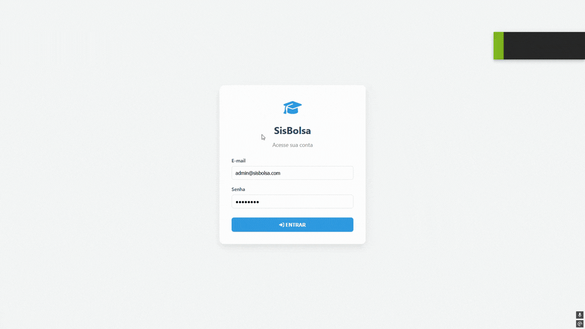
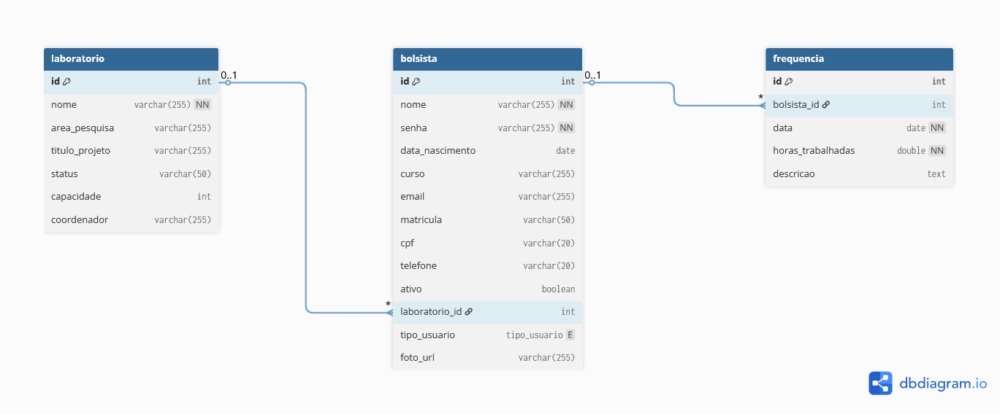

# SisBolsa - Cadastro de Bolsistas e Laboratórios

Sistema web desenvolvido para gerenciamento de bolsistas, laboratórios de pesquisa e registros de frequência. O projeto permite cadastrar usuários bolsistas, organizar bolsistas por laboratório, registrar horas trabalhadas e visualizar relatórios analíticos com base nas informações cadastradas.

## Descrição do Sistema

O SisBolsa é uma aplicação web para apoio à gestão de bolsistas em laboratórios acadêmicos. O sistema possui autenticação por login, controle de sessão, cadastro de administradores, cadastro de bolsistas, cadastro de laboratórios, registro e edição de frequência e geração de relatórios.

Usuários administradores podem gerenciar bolsistas e laboratórios. Usuários bolsistas podem acessar o sistema, visualizar informações, registrar e editar sua própria frequência.

## Preview do Projeto


## Arquitetura do Projeto

O projeto segue uma arquitetura em camadas baseada no padrão MVC.

- `model`: classes que representam as entidades do sistema.
- `controller`: Servlets responsáveis por receber requisições HTTP e direcionar fluxos.
- `service`: camada de regras de negócio.
- `dao`: camada de acesso ao banco de dados usando JDBC.
- `webapp`: páginas JSP, arquivos CSS, JavaScript e componentes visuais.
- `db`: scripts SQL de criação e população inicial do banco.

Fluxo principal:

1. O usuário acessa uma página JSP.
2. A requisição é enviada para um Servlet.
3. O Servlet chama uma classe Service.
4. A Service chama uma classe DAO.
5. A DAO executa comandos SQL no PostgreSQL.
6. O resultado retorna para o Servlet.
7. O Servlet encaminha os dados para a JSP.

## Funcionalidades

### Cadastro de Administrador

Na tela de login há o link **Cadastrar administrador**, disponível enquanto o sistema possuir menos de 3 administradores cadastrados. Ao acessar, é exibido um formulário para criar uma conta de administrador. Caso o limite de 3 administradores já tenha sido atingido, o acesso ao formulário é bloqueado automaticamente.

### Autenticação e Sessão

- Login por e-mail e senha.
- Armazenamento do usuário autenticado na sessão.
- Bloqueio de acesso às páginas internas quando não há usuário logado.
- Diferenciação entre usuário `ADMIN` e usuário `BOLSISTA`.

### CRUD de Bolsistas

O sistema permite:

- Cadastrar bolsista.
- Listar bolsistas.
- Editar bolsista.
- Excluir bolsista (apenas ADMIN).
- Buscar bolsistas por nome.
- Buscar bolsistas por curso.
- Exportar lista de bolsistas em CSV.

Campos principais:

- Nome
- Data de nascimento
- Curso
- E-mail
- Matrícula
- CPF
- Telefone
- Senha
- Laboratório
- Status ativo
- Foto

### CRUD de Laboratórios

O sistema permite:

- Cadastrar laboratório.
- Listar laboratórios.
- Editar laboratório.
- Excluir laboratório.
- Visualizar detalhes do laboratório.
- Listar bolsistas vinculados ao laboratório.

Campos principais:

- Nome
- Área de pesquisa
- Título do projeto
- Status (Ativo, Em Pausa, Concluído)
- Capacidade máxima
- Coordenador

### Registro de Frequência

O sistema permite que bolsistas registrem e editem suas horas trabalhadas.

- Bolsistas podem registrar novos registros e editar apenas os seus próprios.
- Administradores podem visualizar todos os registros, editar qualquer registro e excluir registros.

Campos principais:

- Bolsista
- Data
- Horas trabalhadas
- Descrição das atividades

### Relatórios

O sistema possui uma tela de relatórios que processa as informações cadastradas e exibe:

- Total de bolsistas.
- Total de bolsistas ativos.
- Total de laboratórios.
- Quantidade de bolsistas por curso.
- Quantidade de laboratórios por status.

## Estrutura do Banco de Dados

O banco de dados possui três tabelas principais:

- `laboratorio`
- `bolsista`
- `frequencia`

Relacionamentos:

- Um laboratório pode possuir vários bolsistas.
- Um bolsista pertence a zero ou um laboratório.
- Um bolsista pode possuir vários registros de frequência.
- Uma frequência pertence a um bolsista.

## Modelo ER


## Script do Banco de Dados

O script principal está em:

```text
db/init.sql
```

Ele cria as tabelas `laboratorio`, `bolsista` e `frequencia`, e insere dados iniciais para teste, incluindo 6 laboratórios, 10 bolsistas e um usuário administrador.

## Instalação e Execução

As instruções completas para instalar e rodar o projeto estão no arquivo:

[instalacao.md](instalacao.md)

## Acesso inicial

O script `db/init.sql` cria um usuário administrador para acesso inicial:

```text
E-mail: admin@sisbolsa.com
Senha: teste123
Tipo: ADMIN
```

Também é possível cadastrar novos administradores pela tela de login, até o limite de 3.

## Como Utilizar

1. Acesse a tela de login.
2. Entre com o usuário administrador ou cadastre um novo pelo link na tela de login.
3. Use o menu lateral para navegar entre as áreas do sistema.
4. Cadastre laboratórios.
5. Cadastre bolsistas e vincule-os a laboratórios.
6. Registre frequências.
7. Acesse a tela de relatórios para visualizar os dados processados.
